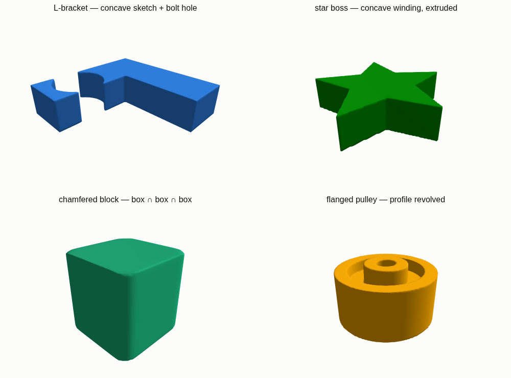
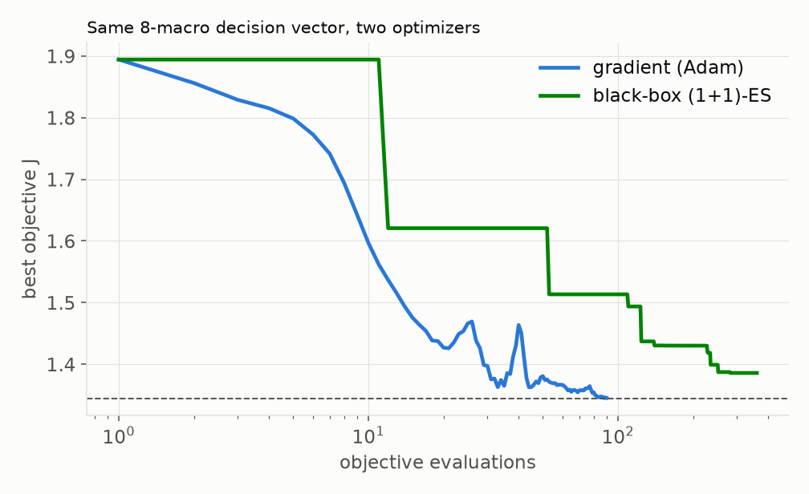

# geomk — a differentiable parametric geometry kernel

An **autodiff-native implicit-modeling kernel** in JAX: every shape is an editable
graph of primitives that resolves to a segmented signed-implicit field which is
**differentiable in its parameters**. The point is one model that can be authored
as CAD, dropped into an optimal-control / co-design loop as a decision variable,
and handed back out as a watertight mesh — *"nTop, but the whole pipeline carries
a gradient."*



*Four parts built from the op set — a concave L-bracket from a 2D sketch with a
punched hole, a star boss (concave winding), a chamfered block (box ∩ box ∩ box),
and a revolved flanged pulley. Each is authored from a vertex list + ops; the
`polygon` primitive is an exact 2D SDF, so sketched profiles stay metric-clean
and can be offset/shelled.*

## Why it's different

The model is **data** — a flat DAG of pure kernels `f(params, children) → field`,
never a Python closure over parameters — so everything downstream of
`params → field` is differentiable and the graph can be authored or regrouped by
a generative model. That makes a full round-trip possible:

**CAD → optimal-control / co-design → CAD → mesh export.**



*A 12-component UAV co-designed over 8 shape macros against a four-physics
objective (flight plant, drag, immersed-FEM compliance, resolution barrier). The
**analytic gradient reaches the optimum in ~90 evaluations** where a tuned
gradient-free (1+1)-ES — on the identical decision vector — never matches it in
360. Gradients are finite-difference-verified to ≤1e-6 in float64.*

## What's here

- **Data-first DAG** + pure op kernels, per-graph JIT; soft partition-of-unity
  region membership composed by declarable **precedence**; hard segmentation only
  on export.
- **Ops:** `sphere, box, capsule, polygon` · `revolve, extrude, loft` ·
  `smooth_union / subtract / intersect` · `rigid` · `offset, shell, redistance` ·
  `lattice`.
- **Differentiable projections** (the solver interface): mass / inertia / COM,
  occupancy (feeding a matrix-free immersed **FEM**), co-area surface area, and
  resolution diagnostics — with an explicit accurate-value / soft-gradient
  fidelity knob.
- **Exposure layer:** flat decision vector + mask + symmetry coupling — the same
  object a gradient optimizer and a black-box optimizer consume.
- **Watertight export:** closed-2-manifold STL / OBJ from the composed field,
  verified (every edge shared by exactly two faces) and volume-cross-checked.
- **69 tests**, incl. a whole-op-set finite-difference gradient CI.

## Quick taste

```python
import jax.numpy as jnp
from geomk.dag import GraphBuilder
from geomk.compose import Component, Assembly
from geomk.projections import GridSpec
from geomk.export import export_solid, write_stl, is_watertight

gb = GraphBuilder()
bracket = gb.extrude(gb.polygon(
    [(-0.7,-0.7),(0.7,-0.7),(0.7,-0.2),(-0.2,-0.2),(-0.2,0.7),(-0.7,0.7)]), 0.18)
asm = Assembly(gb.build(),
               (Component("bracket", bracket, density=1.0, precedence=0),))

grid  = GridSpec(lo=(-1,-1,-0.5), hi=(1,1,0.5), shape=(128,128,64))
theta = jnp.asarray(asm.graph.theta0)

mesh = export_solid(asm, theta, grid)
print(is_watertight(mesh))          # (True, {...})
write_stl("bracket.stl", mesh)
```

Mass properties and every projection are `jax.grad`-differentiable in `theta` —
that gradient is what feeds the co-design loop above.

## Status

The differentiable spine and the CAD → co-design → CAD round-trip work today.
Before a CAD **UI** is worthwhile, the priority is **adaptive / narrow-band
resolution** (retiring thin-feature accuracy, meshing crispness, and interactive
performance together). Full ledger of what's done and what's left:
[**ROADMAP.md**](ROADMAP.md).

```
python -m pytest tests/     # 69 passing
```
